# Intro to Gen AI

### Key Figures

#### 1. Overview of AI Models
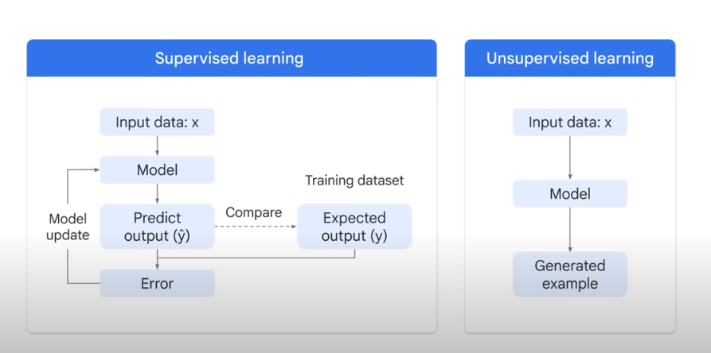

#### 2. Gen AI Programming Techniques
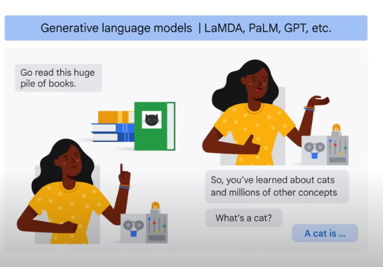

#### 3. Summary of Machine Learning Techniques
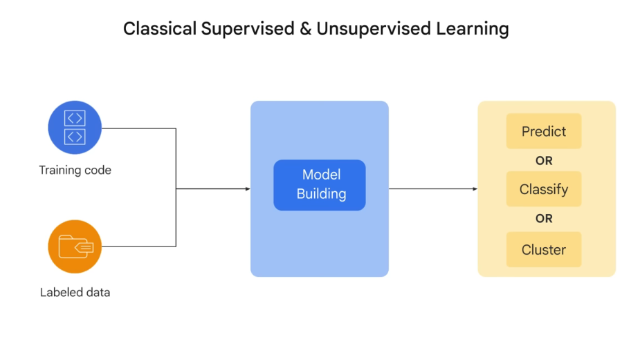

#### 4. Deep Learning Models Overview
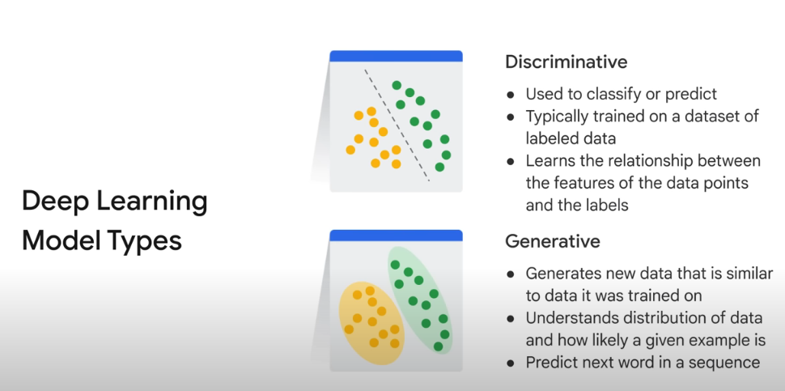

#### 5. Understanding Deep Learning
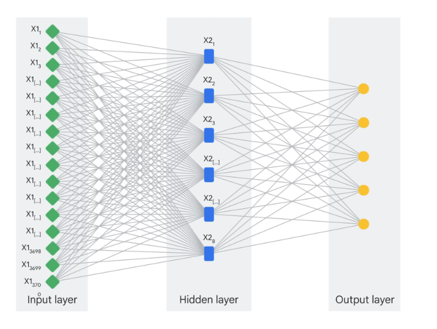

#### 6. End-to-End AI Systems
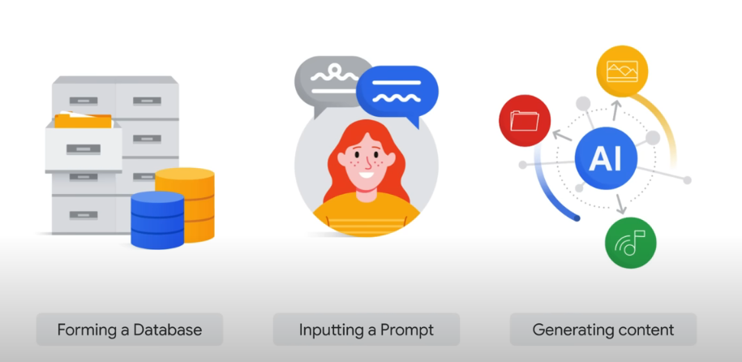

#### 7. Gen AI Summary
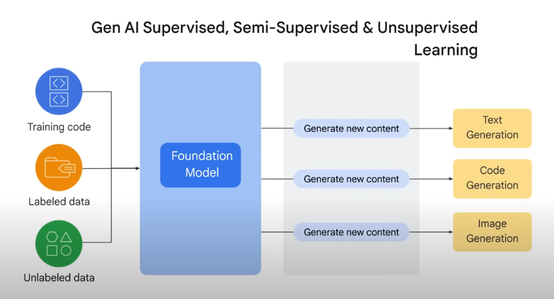

#### 8. AI Hallucinations
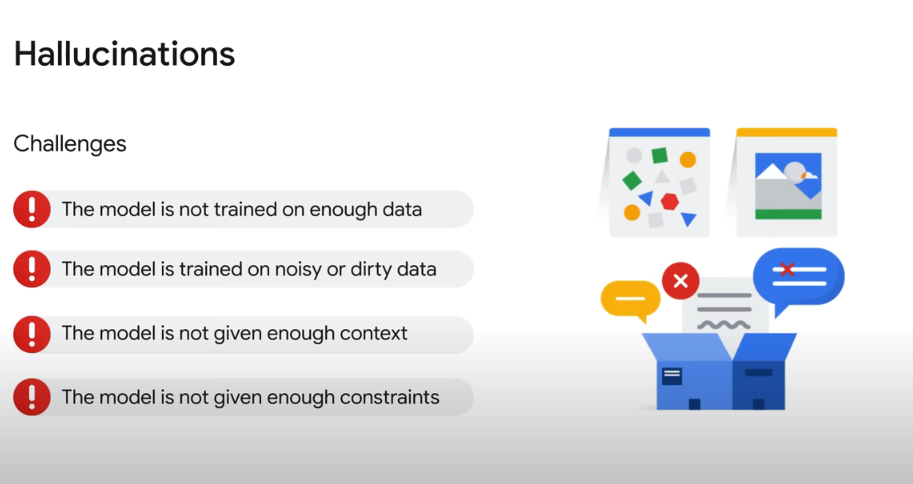

#### 9. What is Generative AI?
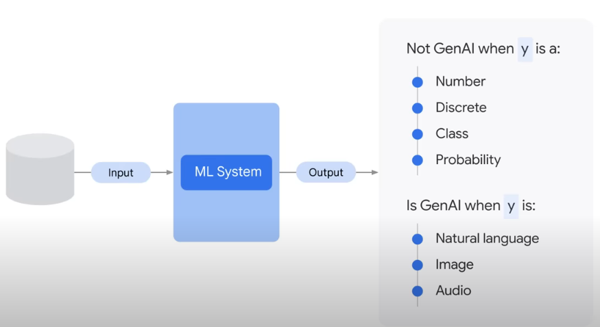

#### 10. Mathematics in AI
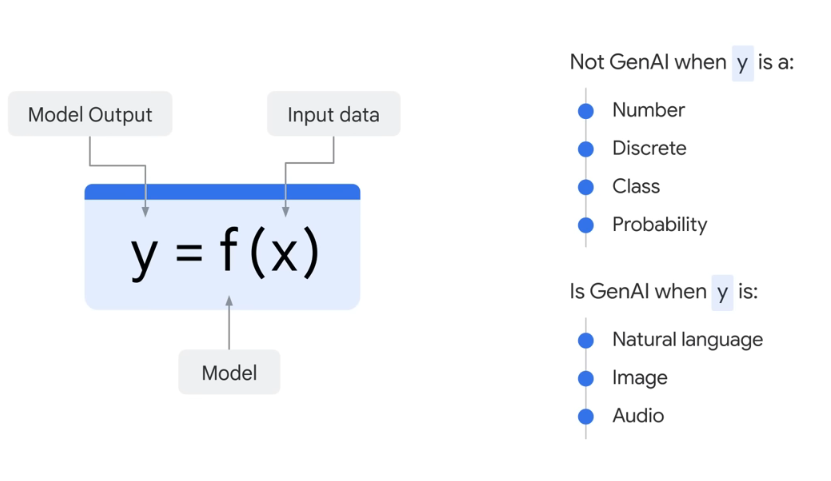

#### 11. Neural Network Programming
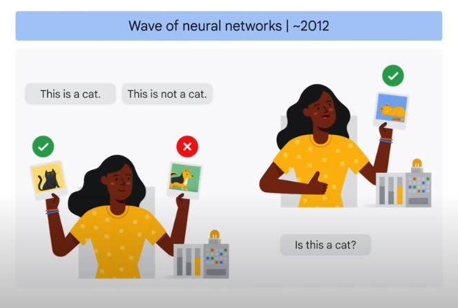

#### 12. Structure of AI Systems
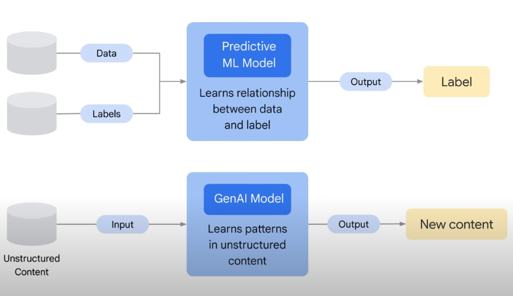

#### 13. Traditional Programming vs. AI

## Additional Notes

For a detailed understanding of each topic, refer to the notes available [here](./figures/notes.md).

