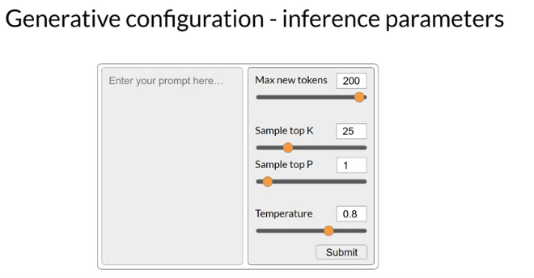
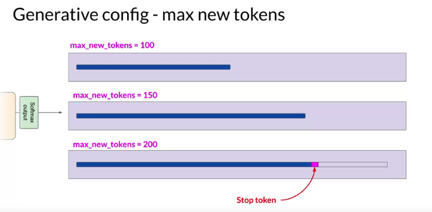
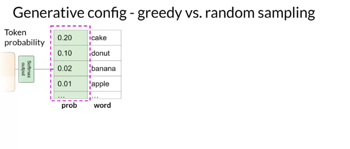
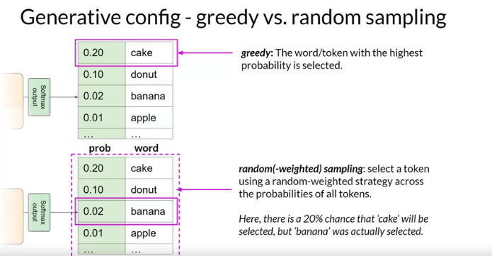
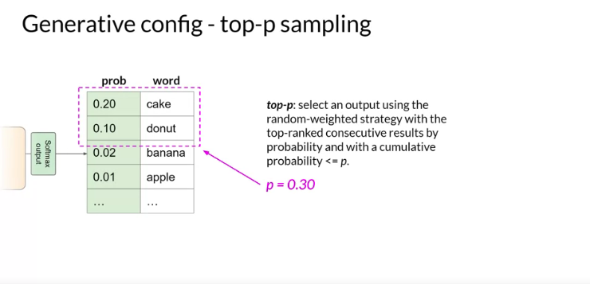
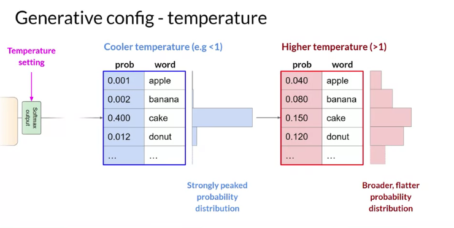

# Methods & Configuration Parameters for LLMs

## Overview
- Understanding methods to influence LLM's next-word generation decisions.
- Configuration parameters adjust how the LLM behaves during inference.

## Inference vs. Training Parameters
- Configuration parameters are invoked at inference time.
- Different from training parameters learned during training.

## Basic Configuration Parameters
1. **Max New Tokens**
   - Limits the number of tokens LLM generates.
   - Example: Setting to 100, 150, or 200.
   - Not a hard number, depends on other stop conditions like end-of-sequence tokens.

2. **Softmax Layer**
   - Outputs a probability distribution across the dictionary of words.
   - Greedy decoding by default: Model picks word with highest probability.
   - Susceptible to repeated words or sequences.

3. **Random Sampling**
   - Introduces variability. Words are selected based on their probability.
   - Reduces repetition but might introduce unrelated words or topics.
   - Need to sometimes disable greedy and enable random sampling explicitly.

4. **Top k & Top p Sampling Techniques**
   - **Top k**: Restricts model to choose from the `k` highest probability tokens.
   - **Top p**: Model picks tokens whose combined probabilities don't exceed `p`.
   - Ensures a balance between randomness and sensibility.

5. **Temperature**
   - Influences probability distribution shape for next token.
   - Higher temperature: More randomness.
   - Lower temperature: Less randomness.
   - Alters predictions the model will make.

## Recap
- LLMs can perform various tasks.
- Understanding transformers and their model architecture.
- Strategies like prompt engineering and inference configuration parameters optimize performance.
- Next: Developing and launching an LLM-powered application.

