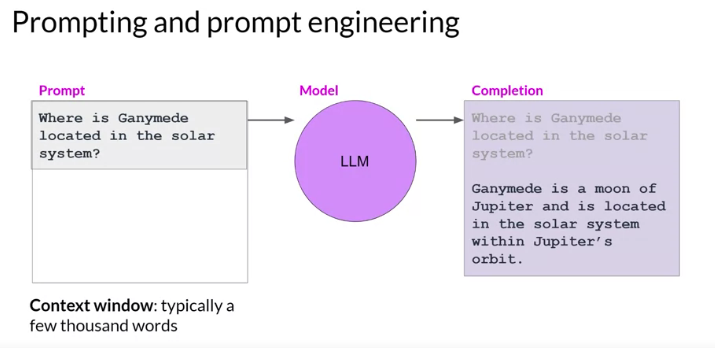
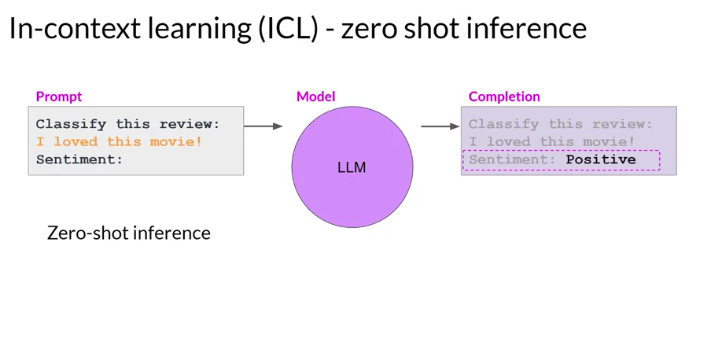
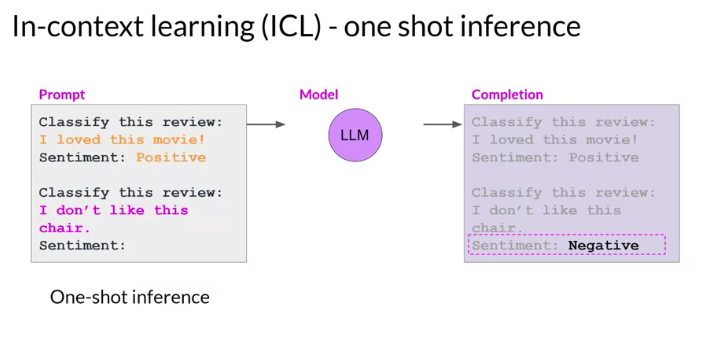
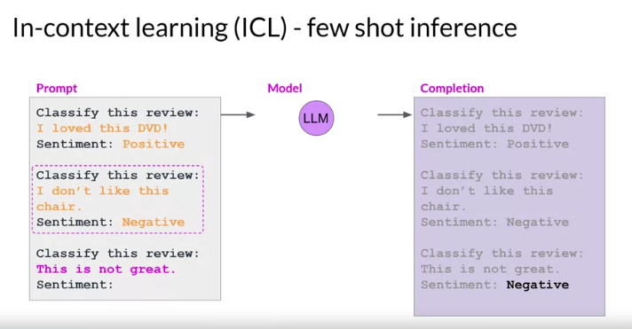

# Prompt Engineering

## Terminologies
- **Prompt:** The input text fed into the model.
- **Inference:** The action of generating text.
- **Completion:** The output text produced by the model.
- **Context Window:** The total amount of text or memory available for the prompt.

## Prompt Engineering
- Refining the input to get desired outputs. It often requires multiple iterations.

## In-Context Learning
- A method to provide models, especially LLMs (Large Language Models), with more context by including examples or additional data in the prompt.
- Helps models better understand the task.

## Types of Inference Based on Context
- **Zero-shot Inference:** Providing input without examples. Large models excel at this.

- **One-shot Inference:** Giving one example to guide the model.
- **Few-shot Inference:** Using multiple examples to guide the model.

## Model Performance
- Larger models with more parameters have a better grasp of language and can handle zero-shot inference impressively.
- Smaller models may require more context and examples and typically excel at tasks similar to their training.

## Fine-tuning
- Additional training on the model using new data to improve its capability. It's explored more in the course's second week.

## Model Scale
- The performance and versatility of a model depend greatly on its size.
- Larger models can handle a variety of tasks even if not specifically trained for them.
- Testing different models might be necessary to find the best fit.

## Configuration Settings
- Once the right model is chosen, one can play around with settings to influence the generated completions.

**Note:** For more in-depth details on configuration settings, refer to the upcoming video.
