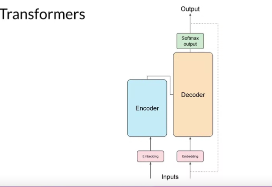
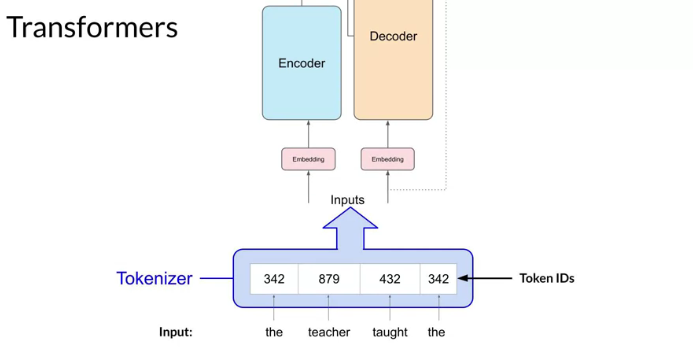
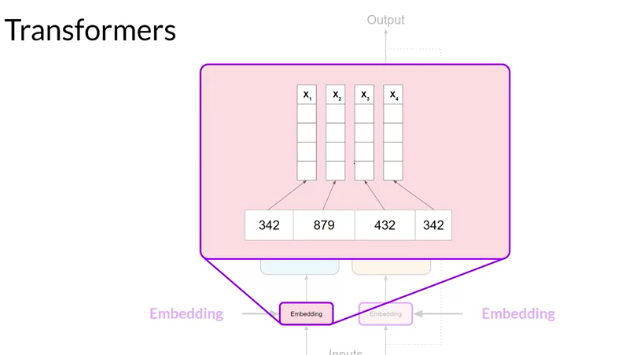
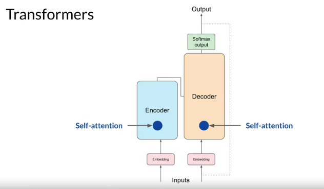

# Notes on Transformer Architecture and Natural Language Processing

---

## 1. Historical Context
- **Generative Algorithms:** Not new in NLP. Earlier generation used RNNs (Recurrent Neural Networks).
- **RNNs:** Powerful, but had limitations, especially with large computations. Struggled with longer contextual inputs.
- **Transformer Architecture:** Major advancement. Brought massive improvements in regenerative capability.

---

## 2. Understanding Transformers
- **Key Attribute:** Self-attention.
- **Self-Attention Mechanism:**
    - Learns relevance and context of all words in a sentence.
    - Assigns attention weights to relationships of words to understand context.
    - Allows algorithm to discern specific details, e.g., who possesses an item in a sentence.
    - Uses an attention map to illustrate attention weights between words.

---

## 3. Transformer Model Overview
- **Components:** Divided into Encoder and Decoder.
- **Data Flow:**
    - Inputs at the bottom.
    - Outputs at the top.
    - Inspired by the original paper "Attention is All You Need."

---

## 4. Language Processing Steps
1. **Tokenization:**
    - Converts words into numbers.
    - Words represented by a position in a dictionary.
    - Types: Complete words or parts of words.

2. **Embedding Layer:**
    - Converts token IDs into vectors within a high-dimensional space.
    - Each token ID matched to a multi-dimensional vector.
    - Vector captures meaning and context.
    - Used in older models like Word2vec as well.
    - Example: Vector size in original transformer paper = 512.

3. **Positional Encoding:**
    - Added to token vectors.
    - Preserves word order information.
  
4. **Self-Attention Layer:**
    - Analyzes relationships between tokens.
    - Weights are learned during training.
    - Multiple sets of weights learned in parallel = Multi-headed self-attention.
    - Each head learns a different aspect of language.
    - Number of heads can range between 12-100.

5. **Feed-Forward Network:**
    - Processes the output from self-attention.
    - Outputs a vector of logits, each representing a probability score for tokens.
  
6. **Softmax Layer:**
    - Normalizes logits into a probability score.
    - Predicts the most likely next token.

---

## Why is Embedding Important in NLP?

1. **Dimensionality Reduction:** 
   - Raw textual data can be vast and sparse. Imagine a one-hot encoded vector for the English language; it might have thousands to millions of dimensions where each word or token is represented by a vector that has a "1" in its position and "0" elsewhere. Embeddings map these high-dimensional vectors to a much smaller, dense vector space, typically a few hundred dimensions.

2. **Semantic Meaning:** 
   - Embeddings capture semantic meaning. Words with similar meanings tend to be closer in the embedding space. For instance, in a well-trained embedding space, the vector representation of "king" minus "man" plus "woman" might be close to "queen". This captures relationships and analogies between words.

3. **Generalization:** 
   - When models use embeddings, they can generalize better from words they've seen during training to those they haven't. If the embedding understands that "cat" and "kitten" are semantically close, even if the model hasn't seen the word "kitten" in the training data for a specific task, it might still produce sensible outputs for it.

4. **Input Uniformity:** 
   - Neural networks require fixed-size input vectors. Sentences and documents of text can vary in length. Embeddings (combined with other methods like pooling) allow us to represent variable-length texts in fixed-size vectors.

5. **Transfer Learning:** 
   - Pre-trained embeddings, like Word2Vec, GloVe, or embeddings from models like BERT, capture knowledge from vast amounts of data and can be used to bootstrap models on specific tasks with much less data. A model using pre-trained embeddings can benefit from the semantic knowledge captured from these larger datasets.

6. **Computational Efficiency:** 
   - Embeddings provide a computationally efficient way to represent text. Dense vectors are more memory and compute-friendly compared to sparse high-dimensional representations.

7. **Supports Further NLP Tasks:** 
   - Advanced architectures like RNNs, LSTMs, and Transformers can take these embeddings as inputs and perform complex tasks like sentiment analysis, machine translation, or question answering.

8. **Contextual Embeddings:** 
   - While initial embeddings like Word2Vec and GloVe provided a single vector for each word, newer models like BERT, ELMO, etc., provide contextual embeddings — different vectors for a word based on its usage in a sentence. This has been crucial in capturing nuances in language that were not possible with earlier embeddings.

In essence, embeddings transform text into a form that machines can process more easily, while preserving (and often enriching) the semantic relationships between words. This representation has been a cornerstone in the advancement of many NLP tasks.

---

## Domain Explanation:

- **RNNs (Recurrent Neural Networks):** Neural networks where connections between nodes form a sequence. Useful for sequential data but can struggle with long sequences due to memory constraints.
  
- **Transformer Architecture:** A newer model architecture that utilizes self-attention mechanisms, allowing it to weigh input tokens differently and capture long-term dependencies in data.
  
- **Self-Attention Mechanism:** Allows the model to weigh the significance of tokens in a sequence, enabling it to focus on the most relevant parts for a given task.
  
- **Tokenization:** The process of converting input text into tokens, which are smaller units of text.
  
- **Embedding Layer:** Represents words as dense vectors of fixed size. The closeness of vectors can represent semantic similarity among the words.
  
- **Positional Encoding:** Adds information about the position of a word within a sequence, necessary since transformers process tokens in parallel and don't have inherent sense of order.
  
- **Softmax Layer:** A function that turns numbers aka logits into probabilities that sum to one. The output of the softmax function is equivalent to a categorical probability distribution.

---
